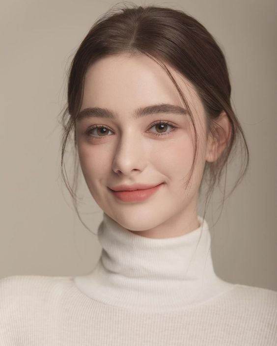

### **Portafolio**

Dominio Propio | Vakku.cl

### **¿Para qué es? - Objetivo**

Para presentarme mis diversos trabajos de diseño a potenciales clientes que esten interesados en un imaginario fantastico, empresas u otros diseñadores, para que puedan conocer los resultados que puedo llegar a entregar como diseñador.

- - - - - - -

### **Usuarios**

## *Lira Martines*

</img>

 Edad: 30 años| 
 Trabajo: Artes visuales|
 Gustos: Fantasia, cottage Core|
 Personalida: Amable, cariñosa, calida

 Necesidad
 Diseñadores y artestas que la ayuden en un proyecto con un enfoque ludico o fantastico.

Frustracion
No encuentra la manera de enfocar su proyecto, muhcas ideas dispersas

## *Rodrigo Miranda*

</img>

 Edad: 45 años|
 Trabajo: Ingeniero comercial|
 Gustos: Fantasia, cottage Core|
 Personalida: Logico, ordenado, clasico, frio

 Necesidad
 Requiere de la ayuda de diseñadores o artistas para un proyecto enfocado a un publico infante

 Frustracion
 No puede conectar con un publico joven, no los ve las necesidades que estos pueden llegar a tener al no entenderlos

## *Rosio Gomez*

</img>

 Edad: 20|
 Trabajo: Estudiante de diseño|
 Gustos: Fantasia, caricaturas, la ilustracion|
 Personalida: calida, curiosa, soliraria

 Necesidad
 Quiere referentes de otros diseñadores que tambien dediquen su trabajo a un estilo mas caricaturesco enfocado en la fantasia

 Frustracion
 No logra aclararse si el diseño es la carrera que ella busca

- - - - - - -

### **Referentes**

1. Es una tienda que genera productos con diseños de perros de todas partes del mundo
</img>
https://dogbreedcartoon.com/

Positivo:La estructura y el rendimiento son buenos 

Negativo: Sineto que todo es muy grande 

2. Una empresa que ayuda a despegar a pequeños y meidos negocios
</img>
https://pandapay.ca/

 Positivo: Original 

 Negativo: Mucho movimiento que puede confiundir al espectador 

3. Pagina que presenta a un artista
</img> 
 https://www.behance.net/gallery/170719613/COMPASS

 Positivo: Directa y presenta lo que quiere que veas 

 Negativo: Demaciado sensilla, simple 

4. Pagina que presenta a un artista
</img>
https://www.behance.net/gallery/170826753/details-warrior

 Positivo: Directa y presenta lo que quiere que veas 

 Negativo: Demaciado sensilla, simple 

5. Pagina que presenta a un artista
</img>

 https://www.behance.net/gallery/111580243/Profile-pictures

 Positivo: Directa y presenta lo que quiere que veas

 Negativo: Demaciado sensilla, simple

6. Portafolio web de una compañia de diseño de videojuegos
</img>
 https://dragonslake.com/

 Positivo: Simple y facil de navegar 

 Negativo: No muy buena gama de colores 

- - - - - - -

## **¿Qué existe que puede inspirar la propuesta? - Referentes**

### MOODBOARD
</img>|